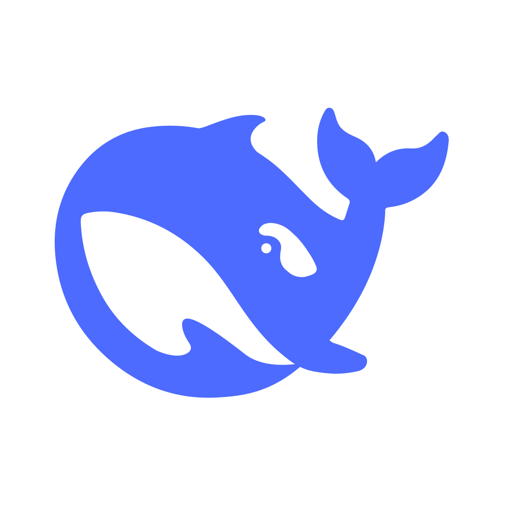
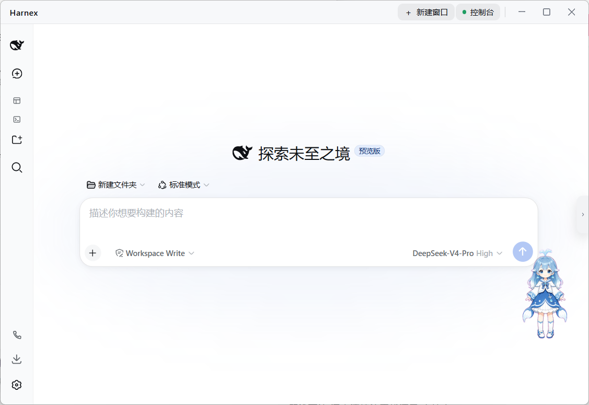

#  Harnex

> Put DeepSeek Harness into your desktop. Open and go.

[中文](README.md) | English


## What is Harnex?

Harnex is a desktop client for [DeepSeek Harness](https://github.com/deepseek-ai) (DSH). DSH used to be browser-only; Harnex turns it into a real desktop app — no need to remember ports, no window switching, just double-click the icon and go, with one-click start/stop and a built-in command box.



## Core Features

- **All-in-one desktop shell** — DSH pages embedded directly in a window, with an integrated top bar that follows DSH's light/dark theme
- **Multiple windows** — open as many as you like; new windows inherit the current size and all share the same DSH instance
- **One-click start/stop** — start / restart / stop with real-time status and startup logs; auto-starts on launch, reuses an existing instance if already running
- **Console drawer** — status, controls, page zoom, command box, settings and About, all in one clean right-side drawer
- **Built-in command box** — streaming output for installing plugins or running npx commands; interactive commands switch to native cmd with one click
- **Page zoom** — 50%–200%, same feel as Ctrl± in a browser, remembered per window
- **Theme & language sync** — change colors or language in DSH, and the Harnex shell follows instantly
- **Window memory** — each window remembers its own position and size; maximized states are never mis-saved
- **Tray resident** — closing all windows keeps the app in the tray, which shows DSH's running status directly

## Quick Start

You only need Node.js 18+ on your machine (Harnex does not bundle Node.js or DSH).

```sh
npm install
npm run tauri dev     # development mode
npm run tauri build   # build installers
```

On first launch, DSH is fetched automatically via npx; a globally installed `dsh` takes priority.

## Tips

- Installing plugins requires pnpm (DSH's plugin management is built on pnpm)
- Interactive commands (e.g. `pnpm install`) are best run in "Native cmd"
- After closing all windows the app stays in the tray; to quit, choose "Quit Harnex" from the tray menu

## Feedback & Support

- Project page: [github.com/YgtqRun/Harnex](https://github.com/YgtqRun/Harnex)
- Issues and feature requests: [GitHub Issues](https://github.com/YgtqRun/Harnex/issues)

## License

[MIT](LICENSE)

> Harnex is an independent third-party project and is not affiliated with DeepSeek.
